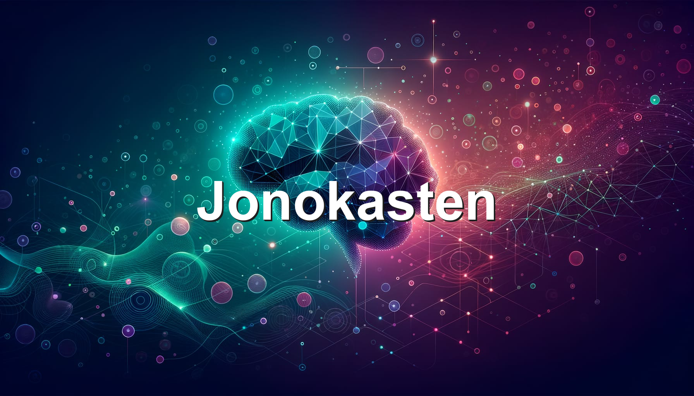

# Tech Guides & Knowledge Base

A collection of technical guides, tutorials, and notes on software development, AI tools, and productivity systems.

## Topics

- **AI & Automation** — Working with AI assistants, coding agents, and automation tools
- **Development** — Ruby on Rails, React, React Native, and modern web development
- **DevOps** — macOS setup, Linux, deployment, and infrastructure
- **Productivity** — Tools, workflows, and systems for getting things done

<!-- Hidden links for graph connections -->

[[MoltBot-Docs/1password-service-account-for-moltbot|1Password Service Account]]
[[MoltBot-Docs/launchagent|LaunchAgent Setup]]
[[MoltBot-Docs/agentmail-setup|AgentMail Setup]]
[[MoltBot-Docs/memory-embeddings|Memory Embeddings]]
[[MoltBot-Docs/obsidian-publishing|Obsidian Publishing]]
[[03-Resources/Tech-Guides/qmd-obsidian-search|QMD - Local Semantic Search]]

